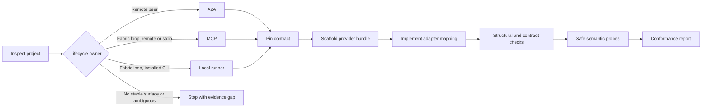

# Fabric Agent Adapter — design

Date: 2026-08-27

## Boundary

The skill is an authoring adapter, not a Fabric host, registry, admission service,
or provider SDK. It converts evidence about an existing project into a proposed
profile and a provider bundle. It cannot grant compatibility; it can only prove the
gates for which it has receipts.

## Workflow



## Components

| Component | Responsibility |
|---|---|
| `SKILL.md` | routes the author through evidence, profile selection, implementation, and verification |
| `references/profile-selection.md` | decision rules and protocol-specific obligations |
| `references/provider-bundle.md` | target file meanings and mapping checklist |
| `references/verification.md` | four-gate verdict model and receipts |
| `assets/*.json` | contract-pinned manifest starting points, never normative replacements |
| `scripts/adapt_project.py` | read-only inspection, non-destructive scaffold, structural check |
| `test/validate.py` | validates the distributable skill/plugin itself |
| `test/evals/*.json` | trigger boundary and behaviour scenarios |

## Script interface

```text
adapt_project.py inspect PROJECT [--json]
adapt_project.py scaffold PROJECT --profile PROFILE --provider-id URI
                         --capability-id URI --capability-name NAME
                         --schema-base URI [--force]
adapt_project.py check PROJECT [--contract PATH] [--json]
```

`inspect` reports evidence and never edits. `scaffold` materialises the target file
contract, substitutes explicit identifiers, and refuses collisions. `check` verifies
local structure and, when a pinned contract checkout is supplied, invokes its
canonical validation command rather than reimplementing the JSON Schemas.

## Data and trust

The helper reads names and small configuration files only; it does not execute the
target project. Generated manifest content is a proposal. The author must replace
placeholder schemas, assertions, endpoints, and effects with evidence-backed values.
Secrets are referenced by the future project binding and are never accepted by the
scaffolder.

